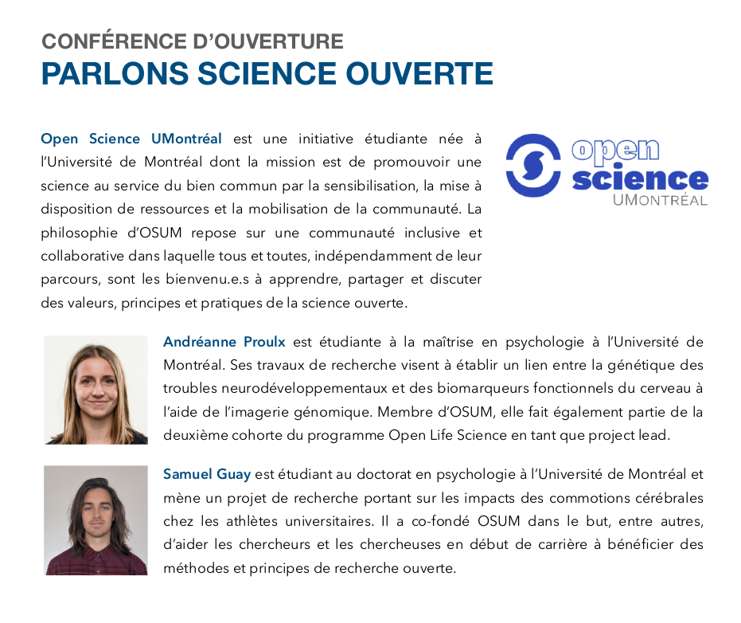

Le 19 novembre dernier marquait la deuxième édition de l'événement Symposium annuel sur la recherche étudiante en sciences infirmières (SARÉSI). 

Cette année, il y avait du nouveau à l’ordre du jour : deux étudiants collaborateurs pour l’Open Science UMontréal (Andréanne et Samuel) étaient invités à venir parler de science ouverte à la conférence d'ouverture.

Réunissant des étudiants à la maîtrise et au doctorat en sciences infirmières, le SARÉSI était une belle opportunité pour l’initiative Open Science UMontreal d'échanger sur la science ouverte avec des étudiant(e)s-chercheur(e)s en sciences infirmières partout au Québec.



**Voici la présentation en attendant notre compte-rendu :)**



<iframe src="https://docs.google.com/presentation/d/e/2PACX-1vQIFXDoOIwqQTHlTEabXWjpmDRNgDQyI39mki7fPw3UFfIQg-jtYQ6SyqLQWDkOSX-Wtp6FHdJfTbZm/embed?start=false&loop=false&delayms=3000" frameborder="0" width="100%" height="500" allowfullscreen="true" mozallowfullscreen="true" webkitallowfullscreen="true"></iframe>

