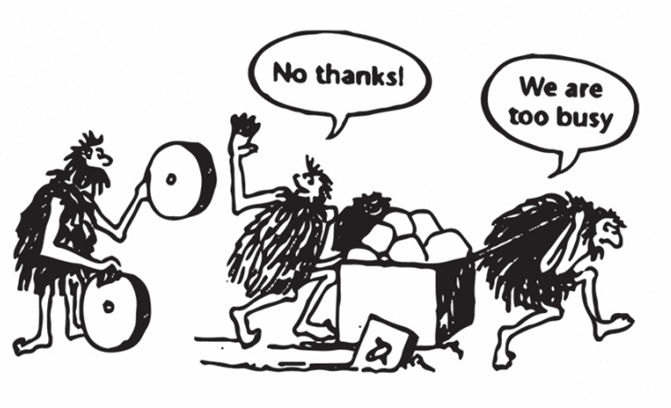

<!-- 
I would like to share what drove me to start looking for open science, without knowing that I was looking for it, *per se*.
 -->

## OSUM is contributing to the steady revolution of science, towards open science

As graduate students / trainees, we believe that science is in trouble.  Spending time talking and developing open science resources – rather than doing ‘actual’ science – is a conscious choice and path to try and improve science. We see open science, an umbrella term, as a solution which can address many of the issues in science today.


I would like to share what drove me to start looking for open science, without knowing that I was looking for it, per se.





The following statements are a hodgepodge of personal experiences, and are un-scientific in nature. Yet, I suspect and believe that they are likely symptomatic of an underlying truth, and that they will resonate with many. These thoughts and conclusions draw from both personal experience within academia, and from reading the thoughts of individuals who have lived similar experiences.

We are very fortunate to live in a time where societies afford us the opportunity of science – to harness knowledge for the good of all; to have a career exploring, and teaching.

I believe that the scientific enterprise, or science as a tool, is the best way to understand the world and universe. We do not have all the methods, nor the wisdom to know all the questions to ask (obviously), but we are well on our way.

I use the word believe with all of the following definitions (which is important to bear in mind)
* accept as true; feel sure of the truth of - almost as if faith
* hold as an opinion; think or suppose
* have seen enough evidence to feel that it is an evidence-based position to hold

## However, to put it bluntly, I am disappointed.

**The story of how science works; what we as a community tell and teach scientists and society, is a fantasy.**

This revolves around the idea of what most people — non-scientists and scientists alike — understand science to, compared to what it is in practice.

This is what it really feels like …

> 

A definition I feel is hard to dispute:
*Science is a systematic enterprise that builds and organizes knowledge in the form of testable explanations and predictions about the universe.* ([Wikipedia](https://en.wikipedia.org/wiki/Science))

Perhaps it’s naive to think that this is truly implementable, but one would be too cynical not to truly aspire for this to happen.

## This is a shame.

Two core issues exist in science, and warrant improvement  
1. The **robustness and reliability** of claims made in the literature 
This is a deep and complex topic. However, it strikes me that being able to replicate findings, and thus be able to rely on the causal claims, is fundamental. Therefore, the issue of replicability in science requires addressing. 
This is a broad question I have. Whether, in fact, the current 'status quo' is actually an optimal system: not too restrictive yet not too rigorous / organized.

1. The way we **“train” scientists**
You don’t really get trained as you might think, knowing what the word training actually means. In reality, many will experience a passive apprenticeship, finding oneself re-inventing the wheel, over and over again.

## We can do better.

It is easy to poke holes in things. Notwithstanding these critiques, we have achieved great things using science as a tool to understand the world. However, that does not mean we cannot do much better. By taking an honest, hard, introspective look at the current state of science, we can improve.

I believe that “open science” – a loose and broad umbrella term – is a philosophy, and way of practicing science, that offers solutions to many of the problems we see in science. 

**If any of these ideas ring true, I invite you to consider open science (and all that it can / could be) as an antidote.**

## Now what...? 
* Learn why we need open science
* Learn more about open science
* Talk to other scientists about open science
* Start practising your science in the open 
* Talk more about open science 

## Join us at Open Science UMontreal / Join us at Open Science Canada 

### The problem we are trying to solve

Within our Canadian and Quebec scientific community we notice several of the common themes that bring scientists to open science. And, despite several governmental and institutional open science roadmaps here in Canada and Quebec, **there is no clear pathway to understand why, nor how to do open science.** This especially true at the level of the individual, whether beginner researcher, established PI, or administrator.

---